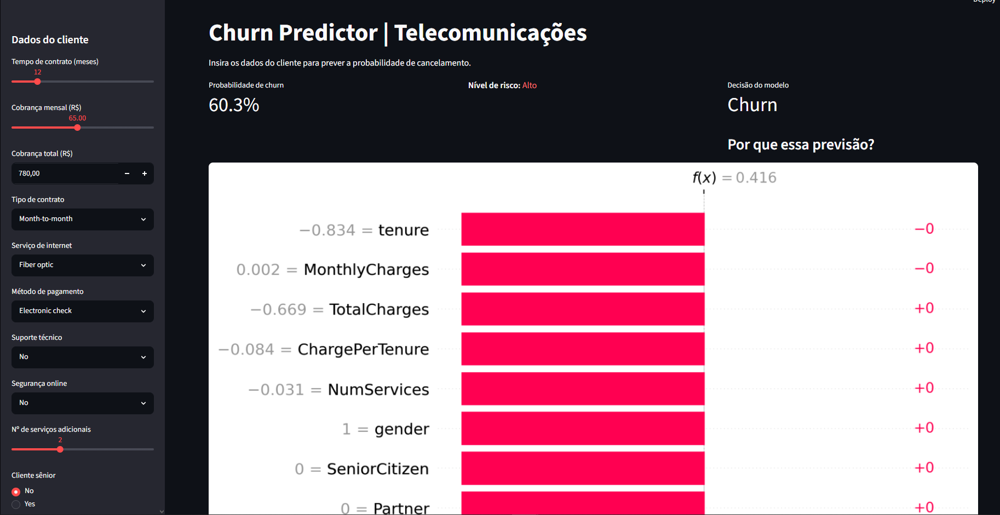
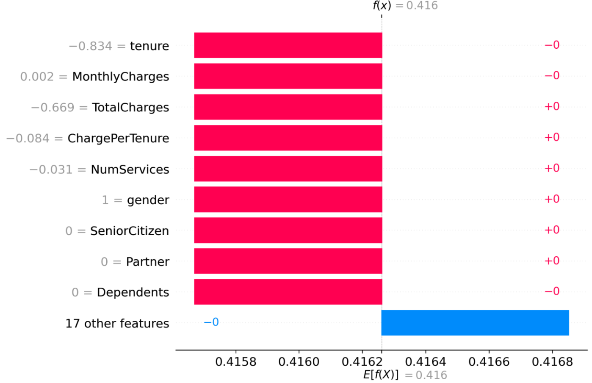
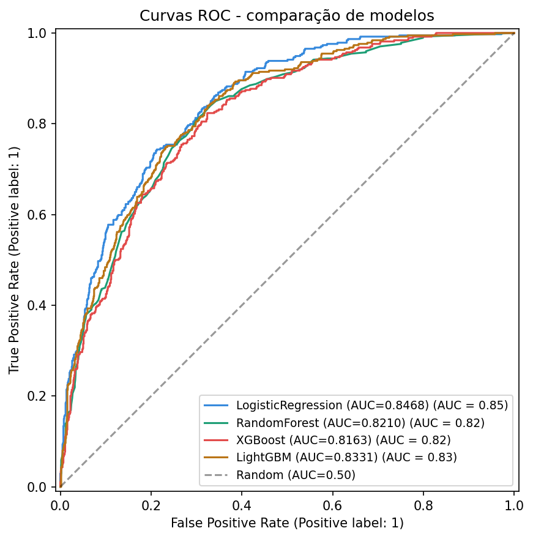

# Churn Prediction | End-to-End ML Pipeline

> Modelo preditivo de churn de clientes com pipeline completo:
> Exploratória -> Pré-processamento -> Modelagem → Explicabilidade → App interativo

## Resultado
| Modelo | AUC-ROC | F1 | Precision | Recall |
|---|---|---|---|---|
| Logistic Regression | 0.8468 | 0.5822 | 0.6678 | 0.5160 |
| LightGBM | 0.8331 | 0.5685 | 0.6250 | 0.5214 |
| RandomForest | 0.8210 | 0.5345 | 0.6096 | 0.4759 |
| XGBoost | 0.8163 | 0.5402 | 0.5839 | 0.5027 |

## Stack
Python · Scikit-learn · XGBoost · LightGBM · SHAP · MLflow · Optuna · Streamlit · Pandas · Plotly

## Estrutura do projeto
```
churn-prediction/
├── notebooks/
│   ├── 01_exploratoria.ipynb
│   ├── 02_preprocessamento.ipynb
│   ├── 03_modelos.ipynb
│   └── 04_explicabilidade.ipynb
├── app/
│   └── streamlit_app.py
├── data/figures/
├── models/
└── requirements.txt
```

## Como rodar

```bash
git clone https://github.com/ferreirapaulo-oliv/churn-prediction
cd churn-prediction
python -m venv venv
venv\Scripts\activate
pip install -r requirements.txt
streamlit run app/streamlit_app.py
```

## Screenshots

### App interativo


### Explicabilidade | SHAP waterfall


### Comparação de modelos | Curvas ROC


## Insights principais
- Contrato mensal tem churn ~42% vs ~3% no contrato de 2 anos
- tenure baixo + MonthlyCharges alto = maior risco
- SHAP confirma Contract e tenure como features mais impactantes
